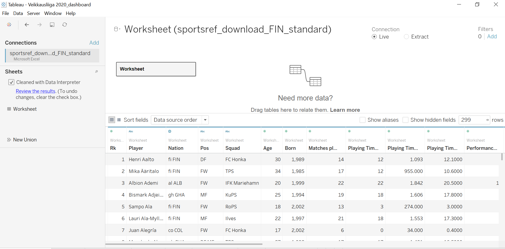

# Football data visualization using Tableau
 I use Tableau and its various features to visualize some of the highlights from the Veikkausliiga season 2020 data and create a highly interactive, informative and engaging dashboard. The Tableau file called `Veikkausliiga 2020_dashboard.twb` contains 1 main dashboard comprising of 6 separate workbooks each of which analyses a particular metric using the free (limited) data available to download in CSV format from https://fbref.com/en/ 
 
The season data is stored in a single file as noted by the filename: `sportsref_download_Veikkausliiga2020.txt`. Each line in each file represents some key stats for a *player*, as identified by `Player` column. Information on each user's searches and engagement is stored in `searches` column. An example of this is shown below:




**Data Description**: The source data resides in S3 `s3://<s3-bucket>` for each day from **2018-01-20** till **2018-03-30**, as shown:
```bash
