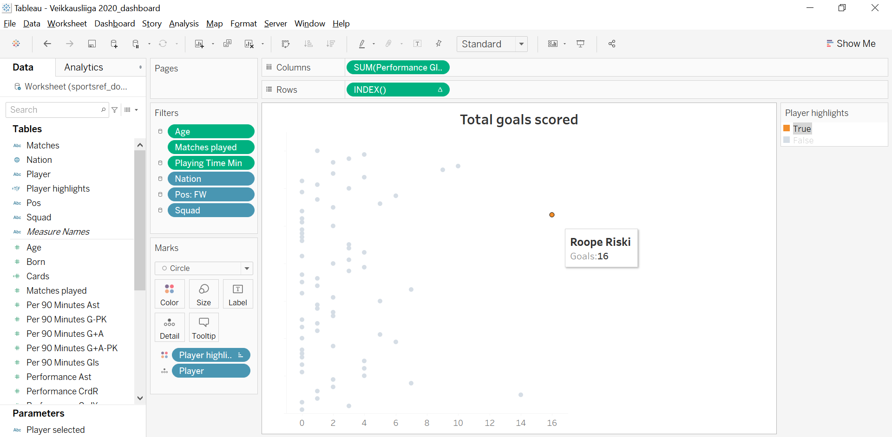

# Football data visualization using Tableau
 I use Tableau and its various features to visualize some of the highlights from the Veikkausliiga season 2020 data and create a highly interactive, informative and engaging dashboard. The Tableau file called `Veikkausliiga 2020_dashboard.twb` contains 1 main dashboard comprising of 6 separate workbooks each of which analyses a particular metric using the free (limited) data available to download in CSV format from https://fbref.com/en/ 
 
**1. Data import**: The season data is stored in a single file as noted by the filename: `sportsref_download_Veikkausliiga2020.txt`. Each line in the file represents some information and key season stats for a *player*, as identified by `Player` column. An example of this is shown below:

*Note*: This season data (free) downloaded from the aforementioned website has significant limitations. It mainly contains player information in terms of performance (frequency of scoring goals, assits, etc.). It does not contain any location data (x-, y-coordinates on the pitch) so that advanced analysis such as, modeling can not be perfomed. 

**2. Understanding the data**: Upon performing a quick search on the file, it is apparent that only the frequency of some performance related metrics such as, `Total starts`, `Total goals scored`, `Total assists`, etc. can be visualized. Depending on the need, separate worksheets were created for each observable metric. All the examples are shown below:

*Worksheet 1*: Frequency of total starts by each player for the season visualized in a scatter plot. Filters such as `Age`, `Matches played`, `Playing Time Min`, `Nation`, `Pos`, `Squad` have been added to assist in narrowing down searches once the worksheet is linked to the main dashboard. Other in-built features help with quick viewing of relevant player information upon clicking the data-point such as that shown above for `Roope Riski`. Additionally, separate features aid in highlighting said data-point while fading the others. 

*Worksheet 2*: Frequency of total goals scored by each player for the season visualized in a scatter plot. Filters such as `Age`, `Matches played`, `Playing Time Min`, `Nation`, `Pos`, `Squad` have been added to assist in narrowing down searches once the worksheet is linked to the main dashboard. Other in-built features help with quick viewing of relevant player information upon clicking the data-point such as that shown above for `Roope Riski`. Additionally, separate features aid in highlighting said data-point while fading the others. 

*Worksheet 3*: Frequency of total assists by each player for the season visualized in a scatter plot. Filters such as `Age`, `Matches played`, `Playing Time Min`, `Nation`, `Pos`, `Squad` have been added to assist in narrowing down searches once the worksheet is linked to the main dashboard. Other in-built features help with quick viewing of relevant player information upon clicking the data-point such as that shown above for `Roope Riski`. Additionally, separate features aid in highlighting said data-point while fading the others. 

*Worksheet 4*: Frequency of goals scored per 90 mins. by each player for the season visualized in a scatter plot. Filters such as `Age`, `Matches played`, `Playing Time Min`, `Nation`, `Pos`, `Squad` have been added to assist in narrowing down searches once the worksheet is linked to the main dashboard. Other in-built features help with quick viewing of relevant player information upon clicking the data-point such as that shown above for `Roope Riski`. Additionally, separate features aid in highlighting said data-point while fading the others. 

*Worksheet 5*: Frequency of goals scored and assists provided per 90 mins. by each player for the season visualized in a scatter plot. Filters such as `Age`, `Matches played`, `Playing Time Min`, `Nation`, `Pos`, `Squad` have been added to assist in narrowing down searches once the worksheet is linked to the main dashboard. Other in-built features help with quick viewing of relevant player information upon clicking the data-point such as that shown above for `Roope Riski`. Additionally, separate features aid in highlighting said data-point while fading the others. 

*Worksheet 6*: Frequency of cards obtained per 90 mins. by each player for the season visualized in a scatter plot. Filters such as `Age`, `Matches played`, `Playing Time Min`, `Nation`, `Pos`, `Squad` have been added to assist in narrowing down searches once the worksheet is linked to the main dashboard. Other in-built features help with quick viewing of relevant player information upon clicking the data-point such as that shown above for `Roope Riski`. Additionally, separate features aid in highlighting said data-point while fading the others. 

*Main dashboard*: The aforementioned worksheets are linked to the dashboard interface to create the `Main dashboard`. In order to make searches intuitive, interactive and informative various `search criteria` are listed in a single-select drop-down list, multi-select drop-down list or a range-select format. This enables collective as well as comparative visualization of player data. 
